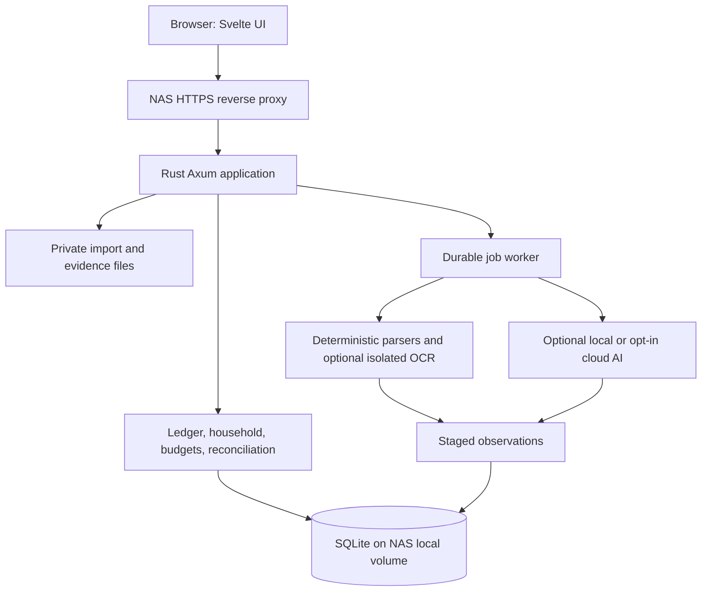

# FinWise architecture

Status: proposed design, 2026-09-30. SQLite is confirmed for v1; the capabilities below remain planned, not implemented.

Detailed module specification: [Analytics and budget tracking](analytics-and-budgets.md).
The route-level contract, common errors, security requirements, and resource payload conventions live in the [HTTP API specification](api-spec.md); update that contract alongside route/schema changes.

## 1. Product scope and assumptions

FinWise turns monthly money-tracking exports into useful personal and family reports, then compares those records with bank evidence to find missing, duplicate, or inconsistent transactions.

Initial assumptions:

- One NAS installation, one household, two independent logins. Model household boundaries from day one so future installations can support more households.
- Money Manager's exact vendor, platform, language, and export schema are unconfirmed. Start with CSV and Excel adapters after inspecting anonymized samples. If it is Realbyte, its documentation describes monthly Excel export, but this does not establish the user's actual schema. [Realbyte export documentation](https://help.realbyteapps.com/hc/en-us/articles/360043325533-Home-tab)
- NAS CPU architecture and RAM are unknown. Target Linux amd64 and arm64 containers; size local AI separately.
- One reporting currency per household in v1; retain original currencies and reject unsupported cross-currency operations rather than silently adding unlike amounts. INR in examples is illustrative.
- Monthly budgets use calendar months in the household timezone. Dates imported without times remain dates; they are not invented UTC timestamps.
- No bank credentials, payment initiation, or live banking integrations in v1. Import files remain the source interface.
- Core importing, budgeting, and manual reconciliation work with AI disabled. Local and optional cloud providers share an interface; cloud transmission is opt-in.

## 2. User experience

Primary navigation: Overview, Analytics, Transactions, Categories, Accounts, Statements, Imports, Budgets, Reconcile, Household, Settings.

| Workflow | Behavior |
|---|---|
| Personal monthly import | Upload → select owner/source → map accounts and columns → preview issues/duplicates → commit → see monthly income, spending, and categories. |
| Partner onboarding | Invite partner → partner creates login → imports their records → chooses which allocations are shared. |
| Analytics | Explore income, category/merchant spending, period trends, account-wise balance/flows, internal transfers, family payer breakdowns, and per-account coverage; drill down to contributing transactions. Keep balances, spending, and transfers as separate measures. |
| Category maintenance | Review imported Money Manager category/subcategory labels, rename or organize FinWise categories, map source labels by transaction kind, and inspect transfer counterpart-account mappings. |
| Budget tracking | Create monthly plans, compare actuals, review revisions, and receive in-app threshold alerts with coverage context. |
| Shared planning | Define family categories, budgets, contribution targets, and shared expenses; compare budget with actuals. |
| Bank audit | Upload one or more statements for one or several accounts → review each file/account and coverage period → see matched, missing, conflicting, and unverified items. |
| Monthly statements | Choose an account and month → view opening/closing balance, period activity, import/coverage status → open that account's reconciliation session. Bank/card source evidence remains distinct from canonical transactions. Cash and settle-up accounts show recorded activity/counts/obligations rather than implying an external statement exists. |
| Reconciliation review | Side-by-side ledger and statement transactions, selected independently, with comparison details, source evidence, and actions: match, reject, create missing entry, correct entry, split/group, or exclude with reason. |
| Month close | Review remaining discrepancies and balance checks → save reconciliation snapshot → explicitly reopen before editing a closed period. |
| Month reset | In Settings, an owner/admin selects up to 24 months, previews affected counts, and types `RESET`. Clear authorized monthly transactions, statement entries, reconciliation records, balance checks, budgets, and staged import rows atomically. Keep account setup, opening balances, categories, original uploads, and audit history. Closed sessions must be reopened first. |

The overview offers Personal and Family scopes. A household-wide combined view includes only authorized shared information. Never label partial visibility as total household wealth or spending. Show coverage, freshness, and unreconciled counts beside totals.

## 3. Stack and deployment shape

| Layer | Choice | Reason |
|---|---|---|
| Backend | Rust, Tokio, Axum, Tower | Typed domain code, async HTTP, middleware, and one server process. Axum integrates with Tokio and Tower. [Axum documentation](https://docs.rs/axum/latest/axum/) |
| Frontend | Svelte 5, TypeScript, SvelteKit static adapter | Reactive transaction/review screens with static deployment and no production Node server. Svelte uses a compiler; actual app performance still requires measurement. [Svelte overview](https://svelte.dev/docs/svelte/overview) |
| Database | SQLite, SQLx migrations and queries | Simple backup and operation for a small household; explicit relational constraints. SQLx supports migration tooling and offline query metadata for CI. [SQLx query documentation](https://docs.rs/sqlx/latest/sqlx/macro.query.html) |
| Imports | Rust CSV parser; Calamine for supported spreadsheet formats | Adapter-based deterministic parsing. Check actual formats against fixtures before declaring support. [Calamine documentation](https://docs.rs/calamine/latest/calamine/) |
| Background work | SQLite-backed jobs; bounded worker tasks in the Rust process | Durable retries without Redis or a separate queue service. |
| API | REST JSON, OpenAPI-generated TypeScript types, SSE job progress | Simple contracts and upload/review workflows; polling fallback. |
| Files | Private local filesystem, DB metadata | Originals, extraction artifacts, and versioned provenance. |
| AI | Provider adapter; optional Ollama on NAS or another LAN machine | Keep model hardware separate from core app requirements. |
| Packaging | Multi-stage Docker image + Docker Compose | Build frontend once; Rust serves static assets and API from one origin. |

Svelte is a practical choice for a fast, compact interactive app, not a claim of universal benchmark superiority. Use server-side filtering and cursor pagination, bounded rendering, lazy-loaded charts, and a small initial bundle. Benchmark realistic reconciliation screens before considering Solid or a Rust/WASM frontend. An all-Rust frontend is possible, but not required by the backend choice.

SvelteKit SPA mode has first-load tradeoffs. For this authenticated, primarily LAN application, static deployment is an intentional operational tradeoff. Serve route fallback only for frontend navigation, never for missing API endpoints or assets. [SvelteKit SPA documentation](https://svelte.dev/docs/kit/single-page-apps)

Use a modular monolith. Domain modules: identity, household, ledger, imports, reconciliation, budgets, analytics, shared reporting policy, AI, and operations. Modules expose application services, rather than letting HTTP handlers update unrelated tables directly. No microservices, vector database, or event-sourcing framework in v1.

## 4. Data model and accounting semantics

The model has three distinct layers:

1. **Source evidence:** immutable uploaded files and source rows.
2. **Observations:** normalized claims extracted from Money Manager or a bank statement.
3. **Ledger:** user-approved financial events used by reports and budgets.

A bank observation linked to an existing ledger event does not create another expense. A confirmed missing bank transaction can create one ledger event and link its evidence atomically.

| Entity | Important fields / relationships |
|---|---|
| users, sessions | Identity, password hash, expiring hashed session token. |
| households, memberships | Timezone, base currency; owner/member roles; explicit membership state. |
| accounts, account_access | Household, subtype, accounting role, currency, owner, joint/private access. Include bank, credit card, cash, and friend-settlement clearing accounts. |
| source_profiles, account_aliases | Member/source-specific parser version, locale, column mapping, external account alias → canonical account. |
| import_batches, source_files | Owner, household, source kind, hash, storage key, status, parser version, lifecycle timestamps. |
| source_rows, observations | Raw row/page reference, signed movement, currency, transaction/posted dates, description, external ID, validation state, superseded revision. |
| transactions | Canonical event type, effective date, merchant, description, revision, creator/last editor membership IDs, void/reversal state. Preserve the member who entered/imported the event separately from account owner/payer and source-file owner. |
| account_movements | Transaction, account, signed amount; asset balances and liability normalization defined by adapter. |
| expense_allocations | Transaction, category, amount, personal/family scope, beneficiary; optional refunded allocation reference. |
| categories, source_category_labels, category_mappings | Editable household hierarchy plus immutable imported labels; mappings keyed by source profile, raw/normalized label, subcategory, and event kind. Transfer counterpart labels resolve to account aliases instead of expense categories. |
| reconciliation_groups, reconciliation_links | Accepted group, observation/movement references, allocated amount, actor, reason, algorithm version. |
| reconciliation_sessions | Transaction-match coverage, account, period, opening/closing balance or cash-count evidence, unresolved counts, closure revision. |
| balance_checks | Account, as-of local time/timezone, balance basis, observed amount, ledger-calculated amount at the same cutoff, variance, source, status, and revision. Preserve each check as an immutable snapshot. |
| settlement_obligations, settlement_links | Counterparty, direction (owed to/owed by), open minor-unit amount, originating expense/split, and explicit settlement movements. |
| budget_plans, budget_plan_revisions, budget_line_revisions | Monthly scope, currency, expected income, lifecycle; immutable category limit revisions. |
| contribution_targets, contribution_links | Member/month targets and explicit links to eligible transfers into shared funds. |
| coverage_claims, budget_alerts, report_exports | Coverage evidence, deduplicated threshold state, and private revisioned report snapshots. |
| jobs, audit_events | Leases/retries and transactional mutation history. |

### Core invariants

- Represent money as checked signed integer minor units plus currency and currency exponent; never floating point. Serialize amounts as strings across JSON where JavaScript precision could be lost. Round percentage splits deterministically and assign residual minor units explicitly.
- All owned records carry household scope. Use composite constraints where practical and enforce authorization in services for every lookup, query, job, export, and evidence download.
- Account movements express money movement; category allocations express spending/income classification. Do not sum both into reports.
- For a same-currency expense, allocations total the outflow. Mixed personal/family allocations are allowed. For income use the corresponding income classification and invariant.
- Same-currency internal transfers have equal and opposite movements and no spending allocation. A credit-card payment is a transfer; the card purchase is the expense. ATM withdrawal is a bank-to-cash transfer if cash is tracked.
- Import `Transfer-In`/`Transfer-Out` as transfer observations, never expense/income categories. Resolve both account labels through source account aliases and automatically create one canonical transfer with two account movements only for a unique reciprocal exact-amount/currency match within the configured date/time window. Retain both source observations. Ambiguous or one-sided rows stay in a transfer-review queue; amount-only matching is insufficient. Budget and spending reports exclude all internal transfer movements.
- Account subtype controls supported behavior: bank accounts reconcile to bank statements; credit-card purchases are expenses with liability movements and card repayments are transfers; cash accounts record cash spending and optional counted-cash reconciliation; friend-settlement accounts track amounts owed to/from named counterparties as clearing balances, not income or a second expense.
- A shared purchase paid by one person can create responsibility shares and settlement obligations. Record the purchase expense once. A later repayment reduces the outstanding obligation and is a transfer/settlement, not another expense. A friend split can track receivable/payable amounts separately from household allocation. Never infer that the whole purchase is family spending when only a share is owed by the household.
- Credit-card statements reconcile against the card account's liability movements. Bank transfers to pay a card are explicitly paired across the bank and card accounts; they do not match individual card purchases or count as spending. Cash records can be reconciled against a dated physical count; a discrepancy is an explicit cash adjustment or unresolved difference, never silently spread over cash expenses. A settlement account has no bank statement by default and is reviewed by open obligations and recorded repayments.

Account behavior is explicit and subtype-specific:

| Account type | Balance meaning | Import/reconciliation behavior | Budget treatment |
|---|---|---|---|
| Bank/debit | Asset balance | Import statement files and reconcile each account/period. | A purchase/withdrawal can represent an expense; transfers are excluded. |
| Credit card | Amount owed (liability) | Import card statements and reconcile card purchases/refunds/fees. Pair card payment across the bank and card accounts as one transfer. | Card purchases count once; card payment does not count again. |
| Cash | Physical cash held (asset) | Record cash transactions; optionally enter a dated counted balance and explain the difference. No bank statement assumed. | Cash purchases count as expenses. ATM withdrawal is a transfer into cash when tracked. |
| Friend split / settle-up | Receivable from or payable to each named counterparty | Create obligations from shared expense splits and link repayments to the open obligation. Review remaining amounts by person/group. Not reconciled against bank statements by default. | The underlying purchase is categorized once. Receivable/payable creation and repayment are not income or new spending. |

Store account subtype and normal balance direction, not a generic “positive balance means owned” assumption. For settlement accounts, retain owed-to and owed-by balances separately by counterparty; do not net different people without an explicit settlement. A real repayment file can still be imported into its bank/cash account and linked to the settlement obligation across accounts.
- Credit-card statements reconcile against the card account's liability movements. Bank transfers to pay a card link the bank debit to the card payment movement; they do not match against each individual card purchase or count as spending. Cash records can be reconciled against a dated physical count; a discrepancy is an explicit cash adjustment or unresolved difference, never silently spread over cash expenses. A settlement account has no bank statement by default and is reviewed by open obligations and recorded repayments.
- Refunds reduce spending and can reference the original category allocation. Reimbursements and partner settlements must be classified explicitly so they do not create duplicate household income or expenses.
- Opening balances are balance adjustments, not income. Unknown starting balances mean account balances are incomplete, even if all observed transactions are matched.
- Corrections produce revisions and audit events. Preserve original evidence. Voiding an event invalidates its reconciliation links and any affected closed-period snapshot.
- Authorized corrections may change an event's type, including expense/income to internal transfer. A transfer requires distinct source/destination accounts and creates exactly two opposite account movements under one canonical event; it contributes nothing to income, spending, or budget actuals. Recompute affected reports and balances, invalidate incompatible reconciliation links for review, and retain source labels, original category, and before/after audit values.
- Limit initial reconciliation to same-currency groups. Cross-currency transfers and FX valuation require a later explicit rate/fee model.

This is a constrained personal-finance ledger, not a full general ledger. Validate supported event types centrally. Do not advertise full accounting or net-worth accuracy until account coverage and opening balances are complete.

### Household example

You pay ₹3,000 for groceries from your private bank account and allocate the entire amount to Family/Groceries. Family actual spending increases by ₹3,000. A 50/50 responsibility split records ₹1,500 each, but does not create two expenses. Your partner's ₹1,500 settlement is a transfer and clears the obligation without changing grocery spending.

If both partners recorded the same grocery purchase, flag a possible duplicate for confirmation. Ownership alone must not force them to be counted twice, and matching descriptions alone must not merge them automatically.

Every transaction list and detail shows **Entered by** with the household member who created the ledger event (or imported it, when import attribution is relevant). Show **Paid from / account owner** as a separate field when known; importing, entering, paying, and benefiting are different roles. Keep creator and edit history in audit events even after a duplicate merge, and apply household privacy permissions to the actor and linked source evidence.

Keep separate concepts: who paid, which account moved, who benefits, who can see the evidence, and whether the allocation counts toward a personal or family budget. Partners can see shared allocations without gaining access to the payer's complete bank statement or unrelated personal rows. Household administration does not grant application-level access to private records; the NAS administrator can still access underlying storage.

### Budget rules

- v1 uses monthly category limits, expected income, and optional contribution targets. Planned values never become actual transactions.
- `actual = committed expense allocations - applicable refunds`; exclude internal transfers, proposals, and voided entries.
- `remaining = effective budget - actual`; family actuals count shared allocations once.
- Parent-category totals roll up children without counting parent and child amounts twice. Define whether a parent line is a cap or a rollup; v1 should use leaf lines with rollups.
- Carryover is off by default; later allow an explicit positive-only or signed policy. Recomputing past months must invalidate subsequent carryover snapshots.
- Imported ledger entries count as tracked actuals even before bank reconciliation. Show their verification status separately.

### Analytics and budget tracking modules

The [module specification](analytics-and-budgets.md) defines screens, formulas, coverage-aware comparisons, budget lifecycle, contribution semantics, storage, APIs, and acceptance fixtures. Analytics and budgets share the same authorized ledger queries and reporting policy; all totals must agree with their transaction drilldowns.

V1 adds category/merchant trends, personal/family analysis, original-versus-current budget revisions, unbudgeted spending, and in-app 80%/100% threshold alerts. Monthly import gaps remain visible. Pacing estimates require explicit complete coverage through a cutoff; an upload timestamp alone is insufficient. Rollover and recurring commitments remain later extensions.

## 5. Import pipeline

Batch states: uploaded → parsing → needs_mapping/needs_review → ready → committing → committed; failures and cancellation are explicit. Workers use leases, heartbeats, bounded retries, and idempotent transitions. Do not hold database transactions while parsing or calling AI.

The import wizard accepts multiple files in one user-selected batch, including files for different accounts and overlapping periods. The batch is a container, not one statement: every file has its own detected format, owner, canonical account, period, extraction result, coverage claim, and review/commit state. Users can map each file separately or apply a mapping to compatible files. Show a per-file queue and aggregate outcome; retry or omit one failed file without discarding successful previews. Stage every file before committing, and keep account-specific review/commit boundaries so one failed card cannot partially corrupt another account. Duplicate checks are scoped to the canonical account and compare with both this batch and prior imports.

Never combine balances from different accounts to validate each other. Preserve source-file boundaries even when two files cover the same account/month. Overlapping periods can contain duplicate transactions; retain both source references, link repeated observations to one canonical movement after review, and count that movement once. Two accounts can have similar transfers, amounts, and dates; account identity is a hard matching boundary except for an explicit paired cross-account transfer match.

The import summary shows files/accounts, coverage periods, accepted/rejected/duplicate counts, balance checks per account, and unresolved failures. A batch is complete only when every selected file reaches a terminal state and each eligible account's coverage is reported. Excluded or failed files remain visible and keep overall coverage partial.

1. Validate size and detected file type; store privately with a hash. Treat filenames as labels, not paths.
2. Choose source adapter and version. Preserve raw rows, sheet/page positions, and extraction artifacts.
3. Normalize dates, debit/credit signs, amounts, currency, accounts, merchants, and categories. Resolve locale ambiguity with preview; never guess ambiguous day/month ordering.
4. Present totals, rejected rows, unknown mappings, and duplicate candidates. Report skipped rows explicitly. Partial acceptance requires a deliberate selection with remaining rows retained.
5. Commit accepted Money Manager observations and new canonical events in one transaction. Bank imports commit observations only until reviewed reconciliation actions occur.
6. Invalidate report caches and expose provenance on every resulting event.

Adapter contract: `detect`, `parse`, `normalize`, `validate`, and `preview_summary`. Profiles are per member/source/account, not global guessed mappings. Excel formulas are not executed, macros are never run, and cells retain raw values for troubleshooting.

Transfer imports are coordinated across all staged files in the selected batch so Transfer-In and Transfer-Out records can pair across account exports. Use reciprocal account aliases, exact amount/currency, a source-configured date/time window, and candidate uniqueness. Commit the paired event and both account movements atomically and idempotently. If only one side is imported, keep its observation pending; if a competing candidate exists, ask for review. A bank statement card-payment row links to the bank movement of the transfer; the card statement payment links to the opposite movement. Neither is matched to the card purchases funded by that payment.

### Idempotency and deduplication

- Same bytes: detect repeats within the authorized household/source/owner context without leaking another user's upload existence.
- Stable external transaction ID: use scoped uniqueness when the source guarantees its semantics.
- No stable ID: create candidate fingerprints from account, dates, amount, currency, and normalized description, but preserve occurrence multiplicity. Two identical coffees on one day may be real purchases.
- Overlapping or reordered exports: compare multisets and evidence, not just a hash set; uncertain matches go to review.
- Changed exports: identify candidate revisions and ask which version to retain; do not silently overwrite curated categories or accepted matches.
- Upload and commit endpoints use idempotency keys with payload hashes. Retrying a committed operation returns its prior result.
- Undo import removes only unreferenced newly created events; otherwise use an explicit reviewed reversal/void flow and reopen affected reconciliations.

## 6. Bank extraction and AI boundaries

Preferred extraction order: structured CSV/XLSX → known text-PDF adapter → OCR for scanned pages → AI-assisted interpretation of unsupported layouts. PDF/OCR tooling runs with time, memory, page, and output limits, isolated from secrets and network where possible. Verify tool licenses before bundling binaries.

Each extracted row includes account hint, transaction and posted dates, raw description, debit/credit or signed amount, currency, optional balance/reference, page/row location, extraction method, and validation results. Missing fields remain unknown. Record model/provider, prompt/schema version, and source hash.

AI may propose column mappings, parse text/layouts, normalize merchant names, suggest categories, or rank already permitted candidates. It does not execute instructions found in statements, access tools, mutate ledger records, or independently authorize matches.

Use schema-constrained responses, then ordinary Rust validation. Structured outputs constrain shape, not factual accuracy. Ollama documents JSON-schema structured outputs; model quality and hardware suitability require fixture-based evaluation. [Ollama structured outputs](https://docs.ollama.com/capabilities/structured-outputs)

Validate statement dates, signs, currency, debit/credit totals, running balances where present, opening/closing balances, and repeated headers. A balanced statement can still have incorrect descriptions or offsetting extraction errors, so balancing alone is insufficient. Missing pages or failed checks block a clean reconciliation status. For password-protected PDFs, request the password transiently for the extraction job and never log or retain it.

AI defaults: disabled until configured; local endpoint preferred; cloud enabled explicitly per source/import. Show what data is sent, redact unnecessary account identifiers, impose token/page/cost limits, and log metadata without statement text or secrets. Local model service can live on another LAN host; do not promise that a low-power NAS can run vision models. Provider failure leaves a resumable manual workflow.

### AI settings: paste an API key

Provide **Settings → AI Providers** so the user can select a supported provider, paste their API key, choose models, test the connection, and save. No source-code edits or container rebuilds are required. A cloud provider is a supported setup choice; running a local model is optional. Specific provider adapters and model compatibility will be verified during implementation.

| Setting | Behavior |
|---|---|
| Provider and display name | Select an implemented provider adapter or local Ollama. Custom endpoints are an advanced setting for adapters that support them. |
| API key | Password-style paste field; optional reveal before submission. After saving, show only “Key configured” and Replace/Remove actions, never retrieve the stored secret. Local providers may not require a key. |
| Extraction model | Model used to interpret bank statements/reports; validate the required text/image and structured-response capabilities. Unsupported PDFs use the existing text/OCR pipeline. |
| Reconciliation model | Model used to rank ambiguous transaction candidates; may reuse the extraction model or have a separate assignment. |
| Feature toggles | Enable statement extraction and reconciliation assistance independently. Saving a key alone does not transmit financial records. |
| Limits | Request timeout, maximum pages/tokens, retry limit, and usage ceiling. Show token/request usage; label monetary costs as estimates when pricing is available. |
| Test connection | Send a small synthetic request with no household data; show authentication, endpoint, model-access, or capability errors without exposing the key. Indicate that the test can incur a small provider charge. |

Setup flow: choose provider → paste key → choose model(s) → Test connection → Save → enable the desired features. Distinguish credential/connectivity validation from actual extraction quality. At import/reconciliation time, disclose which configured provider will receive the selected data and require the applicable source/import cloud opt-in. Never fall back from local to cloud automatically.

Configurations are owned by a user and private by default. The owner may explicitly allow household use without sharing the key; other members cannot read, replace, or export it. Shared provider permission does not grant access to either member's private financial records. Model/provider changes create configuration revisions. Endpoint changes require re-entering the key so an existing credential cannot be silently sent to another host.

Store non-secret metadata in `ai_provider_configs`, model/feature assignments in `ai_task_configs`, and encrypted keys in `ai_provider_secrets`. Encrypt keys with a maintained authenticated-encryption library and a deployment master key mounted outside SQLite. Store nonce and key-version metadata; bind ciphertext to the configuration/owner identity. If the master key is unavailable, block credential storage/use and report the configuration problem. Never fall back to plaintext. Back up the master key separately with a documented recovery procedure.

The browser sends the pasted key once over the authenticated HTTPS API and clears the field after success. Do not store it in localStorage, return it in configuration reads, include it in ordinary exports, or place it in audit logs, job payloads, URLs, telemetry, or exception messages. The backend alone contacts providers. Usage logs contain configuration/model IDs, timing, token counts, and sanitized error codes.

Provider requests require HTTPS for cloud endpoints. Local HTTP is allowed only for an explicitly configured trusted local endpoint. Validate endpoint destinations, block metadata/link-local and unintended internal service targets, disable credential-forwarding redirects, and enforce the endpoint policy on every outbound request. A custom endpoint must be explicitly configured by an authorized administrator; statement content and model output cannot select destinations.

Routes under `/api/v1`: provider configuration create/read/update/delete, write-only key replacement/removal, connection test, task-model assignment, and usage summary. All mutations require appropriate ownership, CSRF protection, and revision checks. Removing a key disables new jobs; queued jobs recheck current authorization/configuration and stop if access was revoked. An already transmitted request cannot be recalled. Configuration revision changes require queued jobs to be reviewed/requeued rather than silently switching provider destinations.

Acceptance: a user can configure a key entirely through the UI and use the same provider for both features. Reloading the page reveals no saved key. Invalid/revoked credentials produce actionable errors and retain the manual workflow. A partner cannot obtain another member's key through APIs, exports, logs, or jobs. Backup restoration without the master key requires key re-entry; with the recovered master key, configuration restoration is tested.

## 7. Reconciliation algorithm and lifecycle

### End-of-day account balance checks

Transaction matching and balance checking are related but distinct. At end of day the user can record the current/posted balance shown by the bank or card provider for each account and compare it with FinWise's calculated balance at the same as-of time. The account screen shows the last check, check age, difference, and unresolved items. A matching balance does not prove every transaction is categorized; fully reconciled status requires both transaction coverage and a zero explained balance variance, when an observed balance is available.

Workflow: choose one account → confirm whether the provider value is posted/current or statement closing balance → enter the actual amount and as-of date/time → compare against ledger-calculated balance at that cutoff → inspect likely causes (unmatched imported rows, pending transactions, missing ledger events, fees, date/posting differences, prior opening-balance errors) → correct/link/create an item or record a reasoned cash adjustment/explanation → save the check. Each check is an immutable snapshot; corrections never rewrite its history. New activity can make the account out of date again. Checks can be repeated daily and reviewed as a balance history/trend.

Use household timezone to derive end-of-day boundaries and store the source timestamp/offset. Compare like with like: a bank's posted/current balance against posted ledger movements; a statement closing balance against that exact statement-period cutoff. Show available balance separately because holds and pending authorizations can differ from posted ledger balance. For credit cards, compare the provider's current outstanding/posted amount owed against card-liability movements; do not compare credit available or confuse statement amount due with current outstanding. Normalize UI as a positive “amount owed” for cards while preserving signed accounting movements internally. If only an unknown opening balance exists, request an explicit starting balance before implying that cumulative ledger balances are reliable.

A daily balance check is not a transaction import and does not create income, spending, or a balancing transaction automatically. If the difference is explained by a missing event, the user creates that event explicitly; a genuine cash-count difference uses a dated, reasoned adjustment. Record actor, account, observed value, calculated value, variance, source (manual check, statement, or counted cash), as-of time, relevant ledger revision, and resolution. Never round away a nonzero variance or mark a check clean until it is exactly zero in minor units. A late transaction/correction flags later balance checks as stale and requests a fresh comparison rather than mutating their stored observations.

At reconciliation, offer a live **balance projection** for a selected account and cutoff: `projected = known starting/opening balance + signed posted ledger movements through cutoff`; `variance = entered actual balance - projected`. Require an explicit starting balance (or mark the projection incomplete) before presenting it as an absolute calculated balance. When reviewing proposed actions, show their projected effect and recompute the variance immediately. Linking a statement observation to an existing movement changes evidence coverage but has zero balance effect. Confirming a missing movement, amount/date correction, or duplicate merge changes the projection by that movement's account effect. Keep proposed changes staged until confirmed; never silently create a balancing adjustment just to force variance to zero. Duplicate merge previews must show both events, each member/record provenance, the retained canonical event, affected balance and budget totals, and source evidence; preserve both original audit/source records and reject merges across incompatible account/currency/event direction unless an explicit reviewed correction handles it.

Reconcile within a mapped account, currency, and statement coverage period. Keep transaction-date and posted-date semantics separate. Cash entries and out-of-period transactions are not automatically missing bank entries.

1. Build candidates using account, direction, currency, exact amount, and a configurable date window (initial suggestion: three days, review against fixtures).
2. Prioritize stable bank references, then merchant aliases and description similarity. Exact same amount/date is not sufficient when there are competing records.
3. Resolve one-to-one candidates globally within the candidate component so one ledger movement cannot be consumed twice. Present score components and competing alternatives; a heuristic score is not a calibrated probability.
4. For unresolved cases, generate bounded one-to-many/many-to-one suggestions for split purchases and grouped settlements. Require exact totals and user review. Explicit fee events resolve fee differences; never hide discrepancies inside an amount tolerance.
5. Optional AI ranks difficult candidates; deterministic monetary and authorization constraints still apply.
6. User accepts/rejects a proposal, creates a missing event, corrects an amount/date, or excludes an observation with a reason. Persist action, revision, and evidence atomically.

Review buckets:

- Matched: accepted evidence link.
- Bank-only: observed movement not represented in the ledger.
- Ledger-only: tracked movement unverified within selected coverage.
- Conflict: plausible relation with amount/date/account inconsistency.
- Ambiguous: competing candidates or possible duplicate.
- Excluded: explicitly outside scope, retained with reason and visible count.

Extraction validity, matching state, and period closure are separate statuses. During initial releases, even high-confidence proposals need approval; bulk approval is available for filtered exact candidates. Later automatic linking requires a measured precision gate and must be reversible.

Use allocated reconciliation amounts for grouped links and enforce that an accepted group consumes each observation/movement only up to its remaining amount. Concurrent decisions use revision checks and transactional revalidation. Two members accepting the same proposal must produce one success and one conflict, not duplicated links.

A fully reconciled period requires complete stated coverage, valid extraction, explained observations and applicable ledger movements, and balance equality when a balance observation exists. Transaction matching and end-of-day balance checking are separate statuses; expose both. If balances are absent, show “transactions reviewed; balance unverified.” Save the snapshot and balance difference; later edits require reopening. Statement overlapping periods must reuse normalized evidence rather than inflate coverage or consumption.

## 8. API and frontend boundaries

Representative routes, all under `/api/v1`:

| Group | Operations |
|---|---|
| Authentication | login/logout, current user, bootstrap, accept invite |
| Household | members, account permissions, category mappings |
| Accounts | list/create/update/archive accounts, account subtype, account access, cash-count sessions, settlement obligations and links |
| Statements | account/month index, statement summary, source-file evidence, opening/closing balance and period activity |
| Transfers | account-to-account history, auto-paired source observations, pending/ambiguous review queue, confirm/reject pair decisions |
| Transfers | account-to-account movement history, paired Money Manager observations, and an unresolved/ambiguous transfer queue |
| Imports | multi-file upload batch, per-file account/period mapping, preview, validation, account-scoped commit, status, retry/omit/cancel |
| Categories | canonical category CRUD/archive/restore/merge preview, source category mapping by kind/subcategory, transfer counterpart account mapping |
| Ledger | paginated transactions, manual entries, revision-checked edits, allocations |
| Budgets | monthly plans, activation/archive/copy, versioned lines, contribution targets/links, actuals, alerts |
| Reconciliation | account-scoped sessions/candidates, accept/reject, duplicate-merge preview/confirm, create missing, close/reopen, daily balance check create/history/stale status |
| Analytics | summary, time series, category/merchant/account/transfer breakdowns, balance snapshots, coverage, filtered drilldowns, report exports |
| Operations | backup/export, configuration, job progress |

Mutations require idempotency keys where retries can create records; edits require expected revision. Return structured validation errors, conflict status, and request IDs. SSE reports job IDs/status only to authorized viewers. Limit batch sizes and preserve per-item outcomes.

Frontend screens use shared currency/date components, URL-backed filters, accessible keyboard review, mobile-friendly summaries, and desktop side-by-side ledger/statement reconciliation. Monthly Statements provides account/month selection, statement balances, period activity, coverage status, and a route into reconciliation; it does not conflate a bank observation with a canonical ledger event. Transaction rows show the member who entered the event, separate from payer/account owner. From the tracked-transactions pane, an authorized member can add a ledger event or select one to edit/void without leaving reconciliation. Changes use normal ledger validations, expected revisions, and audit history; removing means voiding, never deleting evidence. A changed movement invalidates affected accepted links for review. Desktop shows independently selectable transaction lists with exact date/amount/currency/account comparison, candidate score/reason, evidence, and explicit Match/Compare actions. The active pair stays visible; unmatched rows can be selected from either side, and grouped/split matches are built from explicit multi-selection with amount conservation. A balance panel accepts starting and actual balances and previews the exact variance as reviewed ledger corrections change; evidence-only links never alter the projected balance. A possible-duplicate queue offers a provenance-preserving merge preview and explicit confirmation. Server owns money arithmetic and budget calculations. Do not optimistically update financial totals before commit confirmation. Cache keys include user, household, scope, and relevant revisions; clear caches on logout and permission changes. Never cache private API responses in a service worker.

### Mobile-responsive web app — required for v1

All core workflows must work on phones, tablets, and desktops, including uploading exports, mapping columns, reviewing transactions, editing budgets, reconciling statements, and pasting/testing an AI API key. Build mobile layouts from the first frontend milestone; responsive behavior is part of each feature's acceptance criteria. A separate native application is not required.

Use fluid layouts and content-driven breakpoints, initially under 640 px for phone layouts, 640–1023 px for tablet layouts, and 1024 px upward for desktop layouts. Support 320 px viewport width without page-level horizontal scrolling. Wide source documents and genuinely two-dimensional tables may use a clearly bounded scroll/zoom region with an accessible alternative; the surrounding controls must remain usable.

| Area | Phone behavior | Wider-screen behavior |
|---|---|---|
| Navigation | Bottom navigation for Overview, Transactions, Budgets, and More; More exposes Analytics, Accounts, Imports, Reconcile, Household, and Settings. Keep current account/scope visible. | Sidebar navigation with visible account, scope, and period controls. |
| Overview/analytics | Stack summary cards and charts; short labels, tap-accessible details, and expandable data tables. Filters open in an accessible sheet. | Multi-column summaries and charts with inline filters. |
| Transactions | Readable row cards with merchant, date, amount, category, and status; full-page detail/edit view. Explicit selection mode for batch actions. | Paginated table and detail drawer. |
| Imports | Step-by-step upload using the device file picker; stacked mapping fields, per-row preview cards, and persistent server job progress. | Wider previews and side-by-side mapping/evidence where space allows. |
| Budgets/family | Category progress cards, stacked amount inputs, and full-page split/contribution editors. Preserve unbudgeted and coverage indicators. | Budget tables, comparison columns, and expanded member breakdowns. |
| Reconciliation | Switch Ledger/Statement lists without losing selection; keep the active comparison and amount/date discrepancy pinned above Match/Compare actions. | Independently selectable ledger and statement lists, pinned active comparison, candidate reasons, and evidence pane. |
| Accounts | Stacked bank/card/cash/settle-up cards with balance meaning, account status, and appropriate next action. | Account cards grouped by type with statement coverage, cash-count state, or per-counterparty settle-up balances. |
| AI settings | Stacked provider/model fields, paste-friendly key field, reveal control before saving, and clear test/save feedback above the keyboard. | Same workflow in a wider form; same secret-handling rules. |

Controls should target at least 44 × 44 CSS px touch areas with adequate spacing. No essential action may depend on hover, dragging, or swipe gestures. Use labeled fields, visible focus, semantic controls, accessible validation messages, and dialog focus management. Support keyboard navigation, screen readers, browser zoom, reduced motion, and portrait/landscape orientation. Test 200% text zoom without obscured actions or lost values.

Bottom navigation and sticky action bars must respect device safe areas and the on-screen keyboard; reserve content space so they never cover the final row or form action. Avoid nested scrolling outside explicit evidence/table viewers. Formatting must preserve complete financial amounts, currency, signs, and verification status; wrap merchant names rather than truncating essential amounts. Charts must expose values without requiring hover and have a text/table equivalent.

Use the same APIs and financial rules across layouts. After an upload is accepted, parsing continues server-side if the browser backgrounds or disconnects; reopening the app retrieves job status. An interrupted upload offers a safe retry using existing idempotency rules. Persist non-sensitive filter/navigation state in the URL; never persist statements or API keys in browser storage. Detect offline status, retain unsaved non-secret form edits in memory where practical, and explain when saving requires reconnection. Offline ledger mutation and background browser synchronization are outside v1.

Responsive acceptance: test representative widths of 320, 390, 768, 1024, and 1440 px; portrait/landscape; touch and keyboard input; long merchant/category names; large/negative amounts; validation errors; loading/empty states; and the virtual keyboard. Complete upload → preview → commit, family budget edit, statement review → reconciliation acceptance, and API-key test/save on a phone layout. Use browser automation for repeatable layout/workflow checks plus manual iOS Safari and Android Chrome checks for file selection, keyboard overlap, evidence zoom, and background/reconnect behavior. Desktop workflows remain covered as well.

## 9. NAS operations, security, and performance

One application container mounts `/data` for SQLite and private files. Optional OCR and AI services have separate resource limits. Bind to the trusted LAN/reverse proxy; use HTTPS and secure same-origin session cookies, CSRF protection, Argon2id password hashing, expiring invites, login throttling, and no public self-registration after bootstrap.

SQLite WAL has a single writer and requires shared local-host filesystem semantics. Run the app and DB on the NAS with a local volume, not an SMB/NFS-mounted database from another host. Keep writes short, enable foreign keys on every connection, configure busy timeout, and use bounded workers. [SQLite WAL documentation](https://www.sqlite.org/wal.html)

Use a consistent SQLite backup mechanism and capture the corresponding immutable files with a manifest. Coordinate backup with file deletion/garbage collection so the snapshot never references missing evidence. Do not copy only the live main DB file while ignoring WAL. Test restore into a clean installation. [SQLite backup API](https://www.sqlite.org/backup.html)

Storage encryption is a NAS/deployment responsibility unless separately implemented; SQLite is not assumed encrypted. Store provider keys outside ordinary logs and plaintext exports, using a mounted secret or encryption key outside the DB. Backup encryption and recovery of required keys must be documented. Audit history is application-level history, not tamper-proof against the NAS administrator.

Document retention and deletion for original statements, derived text, AI artifacts, and backups. Restrict exports and neutralize CSV formula injection. Keep real statements, secrets, and personal account identifiers out of the public repository, telemetry, crash reports, and fixtures.

Initial performance budgets are targets to validate on documented hardware, not promises:

- Standard profile: 100,000 ledger events; 2–5 concurrent users; 10,000-row structured import.
- Indexed transaction pages and monthly summaries: p95 under 300 ms server time with warm cache.
- Normal interactions: responsive scrolling and no long main-thread stalls; fetch bounded pages.
- Core app memory target: under 512 MiB excluding OCR/model services; import progress updates at least every few seconds.
- Initial compressed JS target: under 200 KiB excluding lazy chart/review features; assess cold load separately.

Start with indexes on household/account/date, category allocations, source external IDs, batch hashes, and reconciliation status. Use SQL aggregates first; add revision-keyed summaries only after measurements. Log timings and job failures without transaction descriptions. Health checks distinguish liveness, DB readiness, and optional AI availability.

## 10. Open-source boundaries and later scope

Recommend Apache-2.0 as the initial license candidate, subject to the maintainer's choice and dependency review. Publish sanitized adapter fixtures, contributor documentation, a security reporting policy, migration notes, reproducible lockfiles, and signed/versioned multi-architecture images.

Later candidates: FX support, savings goals and recurring obligations, configurable rollover, OFX/QIF adapters, more bank templates, OIDC, and an optional PostgreSQL deployment if measured concurrent-write needs justify it. Do not promise SQLx alone makes database portability automatic.

Defer investment valuation, tax calculation, direct banking, mobile-native clients, and automatic financial advice. The first release should make import, household budgeting, and reconciliation reliable.
